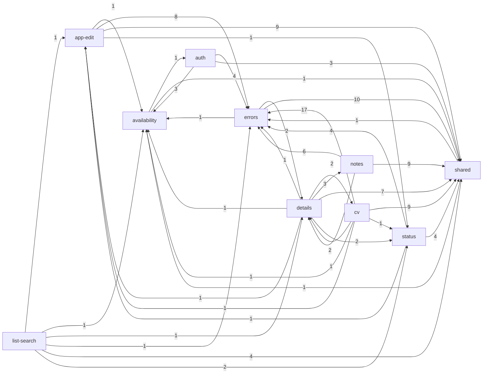

# Evidence: structure

Head a6300be. Raw output in `context/map/.work/` (`edges-ts*.csv`, `edge-files-attributed.tsv`, `graph-*.md`, `blast-radius.txt`, `rpc-calls.txt`, `sql-*.txt`, `tests-by-cap.tsv`).

## Graph sources

| Language                                                                                             | Source                                                                                                                                                                                                                                                                                                                                            | Level           | Confidence                                                                                                                                                                | Blind spots                                                                                                                                                                                                                                                                                     |
| ---------------------------------------------------------------------------------------------------- | ------------------------------------------------------------------------------------------------------------------------------------------------------------------------------------------------------------------------------------------------------------------------------------------------------------------------------------------------- | --------------- | ------------------------------------------------------------------------------------------------------------------------------------------------------------------------- | ----------------------------------------------------------------------------------------------------------------------------------------------------------------------------------------------------------------------------------------------------------------------------------------------- |
| TS / TSX / Astro / MJS (119 tracked files, vendored `.claude/skills`, `.agents`, `context` excluded) | TypeScript compiler API from the project's own `node_modules/typescript` (AST walk: static `import`, `export … from`, `import()`, `require`, `import("…")` types; `import type` / all-type-only specifiers → `type`). `@/*` resolved to `src/*`, relative paths resolved against tracked files. `.astro`: frontmatter + `<script>` blocks parsed. | 2 (toolchain)   | medium-high — 248 edges (227 non-test: 215 runtime, 12 type, 0 build); 1 unresolved (`Layout.astro → ../styles/global.css`, a CSS asset); 3 dynamic imports, all resolved | Astro template usage without import (none possible — components must be imported); Astro-wired runtime (middleware on every request, route files, `@astrojs/cloudflare/handler` in `worker.ts`); HTTP calls between browser islands and API routes (`apiRequest` → `/api/*` URLs) are not edges |
| SQL (supabase/migrations)                                                                            | `git grep` for `create table`, `create function`, `.rpc("…")`, `/rest/v1/rpc/…`, `.from("…")`                                                                                                                                                                                                                                                     | 4 (text search) | low-medium                                                                                                                                                                | policies, triggers and grants not graphed; function bodies' table writes not parsed                                                                                                                                                                                                             |

Repo has no level-1 graph tooling (no dependency-cruiser/madge config). `graph-metrics.mjs --modules capabilities.tsv` does **not** honour the file-stem-prefix rule of `attribute.py` (15 `src/lib/domain/*.ts` files came out unmapped), so edges were folded with `attribute.py` first (`edges-ts-cap.csv`) and the metrics script ran on that. Every endpoint file attributed: 0 unmapped (107 files in the graph).

## Capability graph

`evidence` — runtime edges only, cross-capability, folded via attribute.py (`graph-cap-runtime.md`). Ca/Ce count distinct capabilities.

| Capability                   |  Ca |  Ce | Instability | Note                                                                                                         |
| ---------------------------- | --: | --: | ----------: | ------------------------------------------------------------------------------------------------------------ |
| shared                       |   9 |   5 |        0.36 | Ce comes from `Layout.astro` (2) and `/dev/ui` (5 targets)                                                   |
| errors                       |   8 |   3 |        0.27 | most-imported business capability: `log.ts`, `http.ts`, `api-client.ts`, `client-errors.ts`, `ErrorText.tsx` |
| availability                 |   7 |   2 |        0.22 | fan-in is one file: `src/lib/supabase-paused.ts` (file Ca 9)                                                 |
| status                       |   5 |   3 |        0.38 | `domain/status.ts` imported by app-edit, cv, details, list-search                                            |
| details                      |   4 |   7 |        0.64 | Ca entirely from `src/lib/format.ts` (imported by cv, notes, errors, list-search)                            |
| app-edit                     |   4 |   4 |        0.50 | Ca from `services/applications.ts` (status, cv, list-search) + `domain/changes.ts` (details)                 |
| cv                           |   2 |   6 |        0.75 |                                                                                                              |
| notes                        |   2 |   3 |        0.60 | Ca from details (+ /dev/ui)                                                                                  |
| auth                         |   1 |   3 |        0.75 | only `api/health.ts → supabase.ts` imports it; middleware reach is implicit (see Unknowns)                   |
| list-search                  |   0 |   6 |        1.00 | pure entry point (`dashboard.astro`)                                                                         |
| release, platform, demo-data |   0 |   0 |           — | standalone scripts; no import edge into `src/`                                                               |

Intra-capability runtime edges: shared 23, cv 13, errors 10, auth 9, notes 7, app-edit 6, availability 4, status 1, details 1, list-search 1.

(Edge labels = file-level edges. Dev-only `/dev/ui` kitchen sink excluded from the diagram; it adds shared → status/notes/cv/errors.)

Cross-language edges (`evidence`, `rpc-calls.txt`, `sql-functions.txt`): 8 SQL functions, all called by name from one service file each.

| SQL function (migration)                                      | Caller                                                          | Capability                         |
| ------------------------------------------------------------- | --------------------------------------------------------------- | ---------------------------------- |
| change_application_status, update_application (atomic_writes) | `src/lib/services/applications.ts`                              | app-edit (status write lives here) |
| add_note, edit_note (atomic_writes)                           | `src/lib/services/notes.ts`                                     | notes                              |
| set_application_cv (cv_files)                                 | `src/lib/services/cv.ts`                                        | cv                                 |
| keepalive_ping, keepalive_status (keepalive)                  | `src/lib/services/keepalive.ts`; `scripts/smoke.mjs` (raw REST) | availability                       |
| applied_migrations                                            | `scripts/check-cloud-migrations.mjs` (raw REST)                 | release                            |

Direct table access outside the RPCs: `services/applications.ts` (applications ×4), `services/cv.ts` (cv_files ×4), `services/notes.ts` (applications, notes, status_changes, field_changes), `pages/applications/[id]/edit.astro` (applications ×1), `scripts/demo-data.mjs` (applications, cv_files, storage `cvs`).

## Blast radius per capability

`evidence` from `blast-radius.txt`; contracts = files other capabilities import.

| Capability (crit.)  | Incoming (who breaks)                                                          | Outgoing                                                                                      | Contracts imported by others                                                                                                               |
| ------------------- | ------------------------------------------------------------------------------ | --------------------------------------------------------------------------------------------- | ------------------------------------------------------------------------------------------------------------------------------------------ |
| auth (high)         | availability (health.ts) + implicit: middleware runs on every page/API request | shared, errors, availability (`supabase-paused.ts`)                                           | `src/lib/supabase.ts`                                                                                                                      |
| list-search (high)  | none                                                                           | app-edit, status, details, errors, availability, shared                                       | none                                                                                                                                       |
| app-edit (high)     | status, cv, list-search, details                                               | errors, shared, status, availability                                                          | `services/applications.ts` (cv, list-search, status), `domain/changes.ts` (details)                                                        |
| details (high)      | cv, notes, errors, list-search — all via `format.ts`                           | notes, cv, status, app-edit, errors, availability, shared (Ce 18 files, largest file fan-out) | `src/lib/format.ts` only                                                                                                                   |
| status (high)       | app-edit, cv, details, list-search, (shared via /dev/ui)                       | errors, shared, app-edit                                                                      | `domain/status.ts`, `StatusControl.tsx`                                                                                                    |
| notes (medium)      | details                                                                        | errors, shared, details                                                                       | `NotesPanel.tsx`, `domain/notes.ts`, `services/notes.ts` (all from details page)                                                           |
| cv (high)           | details                                                                        | errors (17 edges, highest pair), shared, app-edit, status, details, availability              | `CvPanel.tsx`, `services/cv.ts`                                                                                                            |
| availability (high) | auth, errors, app-edit, details, cv, list-search, shared                       | auth, shared                                                                                  | `supabase-paused.ts` (6 capabilities), `config-status.ts` (Layout)                                                                         |
| errors (high)       | app-edit, cv, notes, status, auth, details, list-search, shared                | shared, details (`format.ts`), availability (`supabase-paused.ts`)                            | `log.ts`, `http.ts`, `api-client.ts`, `client-errors.ts`, `services/errors.ts`, `ErrorText.tsx`, `ErrorBoundary.tsx`, `stream-observer.ts` |
| release (high)      | none in code; CI runs it                                                       | `scripts/lib/migrations.mjs` (intra)                                                          | none — coupled to `supabase/migrations/` by file reading, not imports                                                                      |
| demo-data (medium)  | none                                                                           | none (talks to Supabase REST/storage directly)                                                | none                                                                                                                                       |

## Cycles

`evidence`: **0 cycles at file level**, runtime or with type edges (`graph-file-runtime.md`). At capability level one 9-node SCC (all business capabilities + shared). `inference`: it is an attribution artefact of where shared helpers are filed, not a code loop. Smallest capability 2-loops and the file pairs that close them:

| Loop                           | Forward edge                                                                                  | Back edge                                                      |
| ------------------------------ | --------------------------------------------------------------------------------------------- | -------------------------------------------------------------- |
| auth ↔ availability            | `lib/supabase.ts`, `api/auth/signin.ts`, `domain/auth-errors.ts` → `supabase-paused.ts`       | `api/health.ts` → `lib/supabase.ts`                            |
| status ↔ app-edit              | `services/applications.ts` → `domain/status.ts`                                               | `api/applications/[id]/status.ts` → `services/applications.ts` |
| details ↔ cv / notes           | `[id]/index.astro` → `CvPanel`, `services/cv`, `NotesPanel`, `services/notes`, `domain/notes` | `CvPanel`, `CvLibrary`, `NotesPanel` → `format.ts`             |
| errors ↔ details               | `500.astro`, `domain/issue-alert.ts` → `format.ts`                                            | `[id]/index.astro` → `log.ts`                                  |
| shared ↔ errors / availability | `Layout.astro` → `client-error-listeners.ts`, `config-status.ts`                              | errors/availability pages → `Layout.astro`, ui components      |

## Broken boundaries

`inference` — intended layering per CLAUDE.md: `types.ts`/`domain/*` (pure) → `services/*` (Supabase) → components/pages/API routes (entry). Runtime edges against it (`evidence` for the edge itself):

1. `src/pages/applications/[id]/edit.astro` queries `applications` directly (`.from("applications")`) instead of a service — the only page that bypasses `src/lib/services/`.
2. The details read (`getApplicationDetails`, reads applications, notes, status_changes, field_changes) lives in `src/lib/services/notes.ts`, so the details page depends on the notes service for its whole read model.
3. The status write (`changeApplicationStatus` → `change_application_status`) and the list read (`listApplications`) live in `src/lib/services/applications.ts`, so status and list-search depend on app-edit's service.
4. `src/lib/format.ts` (date formatting, attributed to details) is a de-facto shared utility imported by cv, notes, errors, list-search.
5. `src/lib/supabase-paused.ts` (availability) is imported by the auth client, error HTTP helper and five pages — a cross-cutting infrastructure contract filed under one capability.
6. `shared` → feature edges: `Layout.astro` imports errors (`client-error-listeners.ts`) and availability (`config-status.ts`); `/dev/ui` imports feature panels (dev-only, expected).

No domain file imports a service or component (`evidence`: domain files have Ce 0 except `status.ts → types.ts`, `issue-alert.ts → format.ts`, `auth-errors.ts → supabase-paused.ts`).

## Test risks

`evidence` (`tests-by-cap.tsv`, `edges-ts-tests.csv`): unit tests import only pure files — `domain/*` (11 files), `services/errors.ts`, `stream-observer.ts`, `supabase-paused.ts`, `scripts/lib/migrations.mjs`. **No unit test imports any Supabase service (`applications.ts`, `notes.ts`, `cv.ts`, `keepalive.ts`), any API route, or any React component.**

| Capability                  | Isolated testability (`inference`)                                                                                  | Existing coverage (`evidence`)                                                                |
| --------------------------- | ------------------------------------------------------------------------------------------------------------------- | --------------------------------------------------------------------------------------------- |
| app-edit, notes, status, cv | Services take a `SupabaseClient` and call RPCs → unit test needs heavy mocking; realistic path is pgTAP + smoke/e2e | pgTAP `atomic_writes`, `history_traces`; Playwright `status-revert`; smoke (HTTP, not import) |
| details                     | Page has Ce 18 across 7 capabilities — only integration/e2e can exercise it                                         | none direct (smoke covers details page over HTTP per CLAUDE.md)                               |
| cv                          | `CvPreview` lazy-loads `cv-render.ts` (pdf.js, docx-preview) — browser-only                                         | `domain/cv.test.ts` only                                                                      |
| auth                        | middleware + `supabase.ts` need cookies/Astro context                                                               | `auth-errors`, `redirect` tests; e2e `auth.setup`                                             |
| availability, errors        | Pure rules extracted and tested; `worker.ts` scheduled handler not import-tested                                    | 3 + 6 test files, best covered                                                                |
| list-search                 | `search.ts` pure                                                                                                    | `search.test.ts`, e2e `call-phone-search`                                                     |

## Centres and thin entry points

`evidence` (file level): high Ca, low instability — `src/lib/utils.ts` (Ca 17, I 0), `src/lib/domain/client-errors.ts` (11, 0), `src/layouts/Layout.astro` (11, 0.21), `src/types.ts` (10, 0), `src/lib/log.ts` (10, 0.09), `src/lib/supabase-paused.ts` (9, 0), `src/components/ui/button.tsx` (9, 0.1), `src/lib/http.ts` (8, 0.2), `src/lib/api-client.ts` (8, 0.11), `src/lib/format.ts` (7, 0).
`inference`: the load-bearing contracts of business behaviour are `supabase-paused.ts`, `log.ts`/`http.ts`/`api-client.ts`/`client-errors.ts` (errors), `domain/status.ts` and `services/applications.ts`; `utils.ts` (`cn()`) and `ui/*` fan-in is config-like (rule 2) — cheap.
Thin entry points: `src/worker.ts` (Ce 1 → `services/keepalive.ts`, plus external Astro handler), `src/middleware.ts` (Ce 4), API routes with Ce 2–4. Fattest entries: `[id]/index.astro` (Ce 18), `/dev/ui` (16, dev-only), `dashboard.astro` (10), `edit.astro` (8), `cv.astro` (8).

## Mechanical signals

- Type-only edges: 12 (8 into `src/types.ts`; `ApplicationForm.tsx`/`edit.astro` → `services/applications.ts`; `ErrorText.tsx` → `client-errors.ts`; `CvPreview.tsx` → `cv-render.ts`). They create no cycles.
- Build edges: 0 (`astro.config.mjs`, `vitest`/`playwright`/`eslint` configs import no local file).
- Config-as-code fan-in (rule 2): `utils.ts` Ca 17, `components/ui/*` (button 9, alert, label, card…), `Layout.astro` 11 — by design.
- `/dev/ui` (shared, dev-only, 404 in production): 16 outgoing edges incl. 5 into feature capabilities — inflates shared's Ce and the capability SCC.
- Capability-level SCC: produced by helper placement (format.ts, supabase-paused.ts, Layout.astro), not file cycles.
- Scripts (`check-*.mjs`, `smoke.mjs`, `demo-data.mjs`, `.claude/hooks/*`) form islands: 4 non-test edges total.

## Unknowns

- `unknown` implicit runtime coupling not in the import graph: Astro middleware on every request (auth → all pages/APIs), file-system routing, `worker.ts` → `@astrojs/cloudflare/handler` (whole app), cron trigger in `wrangler.jsonc`, Cloudflare Issues → `POST /api/alerts/issue` webhook, Telegram API, browser islands → API routes via URL strings in `apiRequest`, `scripts/smoke.mjs` → app over HTTP.
- `unknown` SQL side: RLS policies, triggers, grants and which tables each SQL function writes were not graphed (text search only). Migration lint / cloud gate couple `release` to `supabase/migrations/` by reading files, not imports.
- `unknown` external consumers: `/api/health` (GitHub `health.yml`), `/api/alerts/issue` (Cloudflare) — consumers outside the repo.
- Dynamic imports: 3, all resolved (`CvLibrary`/`CvPanel` → `CvPreview`, `CvPreview` → `cv-render`).
- Tools worth installing (not installed, not run): **dependency-cruiser** (with `tsConfig` + an Astro-aware extension or `astro check` pre-pass) for enforceable layer rules (`domain` must not import `services`, pages must not call `.from(`); **madge** for quick cycle checks. `graph-metrics.mjs --modules` should learn attribute.py's file-stem prefix rule.

Commands run: `git ls-files`; `node scratchpad/edges.mjs` (TS compiler API extractor → `edges-ts*.csv`); `python3 context/map/.work/attribute.py` (endpoint attribution); `node .claude/skills/10x-repo-map/scripts/graph-metrics.mjs` (capability runtime, file runtime, file all, capability without /dev/ui, `--emit mermaid`); `git grep` for `.rpc(`, `rpc/`, `create table`, `create function`, `.from(`, `locals.supabase`, `export function` in services, `vi.mock`.
