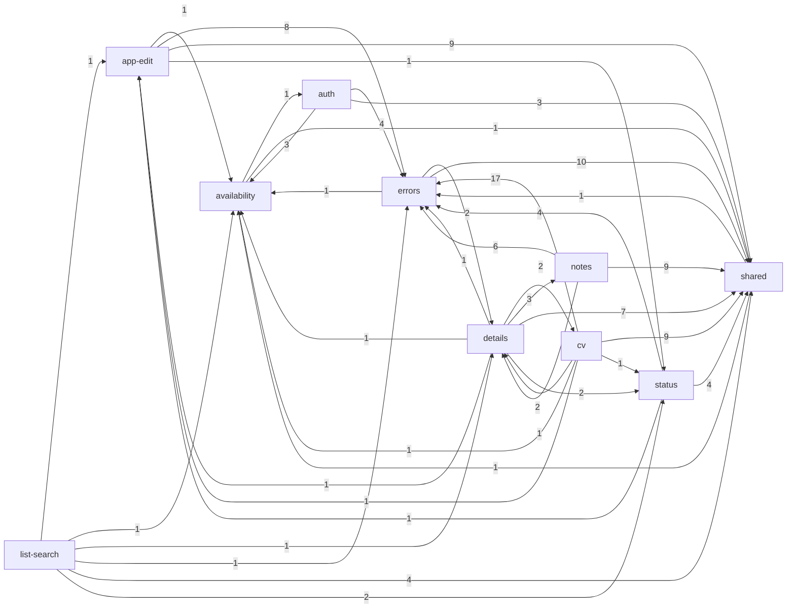

# Mapa projektu: Applications Tracker

## TL;DR

Applications Tracker to jednoosobowa aplikacja (Astro SSR na Cloudflare Workers + Supabase) do śledzenia aplikacji o pracę. Właściciel podczas rozmowy na telefonie odnajduje aplikację, widzi jej status, stawki, notatki i CV, a każda zmiana zostawia ślad w historii. Rdzeń produktu tworzą lista z wyszukiwaniem, szczegóły aplikacji z panelami (status, notatki, CV) i edycja z dziennikiem zmian. Obok działają trzy funkcje „operacyjne”: dostępność (keepalive, `/paused`), widoczność błędów (Issues → Telegram) i bezpieczny release (migracje, CI).

Historia jest krótka (8 dni, 96 commitów, jeden autor, prawie wszystko pisane z agentem), więc „ruch” to w praktyce kolejność budowy, a nie trend. Mimo tego trzy obszary wyraźnie łączą wysoką krytyczność z niezależnymi sygnałami:

- **CV**: najwięcej zmian i najwyższy udział poprawek, do tego krytyczne znaleziska audytu i limit CPU w rejestrze ryzyk;
- **obsługa błędów**: najczęściej importowana funkcja, świeżo przebudowana;
- **dostępność**: jeden plik `supabase-paused.ts`, od którego zależy 7 funkcji.

_Graf z `evidence/3-structure.md`: krawędzie runtime między funkcjami, etykieta = liczba krawędzi plik→plik; `/dev/ui` (tylko dev) pominięty._

## Teren

Ruch w poszczególnych rodzinach sygnałów (zmiany, poprawki, tarcie, uwaga, zasięg) jest oceniany względem innych funkcji. „mech.” = sygnał mechaniczny, który nie liczy się do ryzyka.

| Funkcja          | Co robi                                                                                                        | Krytyczność                                                               | Zmiany                                  | Poprawki                             | Tarcie                                 | Uwaga                                                              | Zasięg                                               | Gdzie żyje                                                                                                       |
| ---------------- | -------------------------------------------------------------------------------------------------------------- | ------------------------------------------------------------------------- | --------------------------------------- | ------------------------------------ | -------------------------------------- | ------------------------------------------------------------------ | ---------------------------------------------------- | ---------------------------------------------------------------------------------------------------------------- |
| **cv**           | Upload do 5 MB z deduplikacją SHA-256, podpięcie do aplikacji, podgląd PDF/DOCX, biblioteka `/cv`              | wysoka (dane użytkownika, prywatny storage, upload z zewnątrz, limit CPU) | **wysokie** (40 / 12 commitów)          | **wysokie** (25%, 1 samodzielna)     | średnie (poprawka poza planem 8538671) | **wysoka** (S-02, audyt: 2 krytyczne + 3 wysokie, ryzyko CPU 1102) | średni (Ce 6, Ca 2)                                  | `components/applications/Cv*`, `services/cv.ts`, `domain/cv.ts`, `api/cv/*`                                      |
| **errors**       | Centralny hook błędów, logi JSON, `500.astro`, webhook Issues → Telegram, raporty z przeglądarki, `apiRequest` | wysoka (publiczny webhook; wszystko zależy w runtime)                     | średnie (27 w 5 commitach, 10-05..06)   | brak                                 | brak                                   | **wysoka** (audyt 42 znaleziska, 5 krytycznych; F-01)              | **wysoki** (Ca 8)                                    | `lib/log.ts`, `lib/http.ts`, `lib/api-client.ts`, `domain/client-errors.ts`, `api/alerts`, `api/client-error.ts` |
| **availability** | Cron keepalive, `/api/health`, wykrywanie uśpionej bazy, strona `/paused`, codzienny workflow Health           | wysoka (może położyć całą aplikację; publiczny endpoint)                  | średnie (21 / 7)                        | niskie                               | niskie                                 | **wysoka** (S-01 north star; ryzyko „Supabase pauses” M/H)         | **wysoki** (`supabase-paused.ts` → 7 funkcji)        | `worker.ts`, `lib/supabase-paused.ts`, `api/health.ts`, `services/keepalive.ts`, `paused.astro`                  |
| release          | CI, deploy, lint migracji, bramka migracji w chmurze                                                           | wysoka (deploy może zepsuć produkcję)                                     | wysokie, mech. (ci.yml 15)              | mech. (iteracje CI)                  | niskie                                 | **wysoka** (S-03, 2 z 3 lekcji, ryzyko L/H)                        | nieznany (poza grafem importów)                      | `.github/workflows/ci.yml`, `scripts/check-*migrations.mjs`, `scripts/lib/`                                      |
| auth             | Logowanie, sesja, middleware, klasyfikacja błędów Auth                                                         | wysoka (tożsamość; każde żądanie)                                         | średnio-wysokie (31 / 10; middleware 8) | niskie                               | niskie                                 | **niska** (brak własnej zmiany; ryzyka testów #5, #6)              | niejawny (middleware na każdym żądaniu, poza grafem) | `middleware.ts`, `lib/supabase.ts`, `api/auth/*`, `domain/auth-errors.ts`                                        |
| status           | Dozwolone przejścia, marker cofnięcia, `status_changes`                                                        | wysoka (reguła biznesowa, dane)                                           | niskie (17 / 11)                        | niskie                               | niskie                                 | wysoka (faza testów 2, ryzyko #3)                                  | średnio-wysoki (Ca 5)                                | `domain/status.ts`, `StatusControl.tsx`, `api/.../status.ts`                                                     |
| details          | Widok szczegółów składający panele                                                                             | wysoka (rdzeń; telefon podczas rozmowy)                                   | niskie (8)                              | brak                                 | niskie                                 | średnia (S-04, ale zmiany głównie w shared)                        | **wysoki fan-out** (Ce 18 plików, 7 funkcji)         | `pages/applications/[id]/index.astro`                                                                            |
| list-search      | Lista wg ważności, `?q=`, `?status=`                                                                           | wysoka (rdzeń: znaleźć aplikację w trakcie rozmowy)                       | średnie (18 / 12)                       | niskie                               | niskie                                 | wysoka (faza testów 1, ryzyko #1)                                  | niski (czysty punkt wejścia)                         | `pages/dashboard.astro`, `domain/search.ts`                                                                      |
| app-edit         | Dodawanie i edycja z dziennikiem zmian (funkcje SQL)                                                           | wysoka (dane użytkownika)                                                 | średnie (27 / 8, wszystkie przekrojowe) | brak                                 | niskie                                 | niska (bez własnej zmiany; ryzyko #4)                              | średni (Ca 4 przez `services/applications.ts`)       | `services/applications.ts`, `ApplicationForm.tsx`, migracja `atomic_writes`                                      |
| notes            | Notatki z rewizjami, miękkie usuwanie                                                                          | średnia                                                                   | niskie (19 / 9, wszystkie przekrojowe)  | niskie (przeniesione z innej zmiany) | niskie                                 | niska                                                              | niski                                                | `NotesPanel.tsx`, `services/notes.ts`                                                                            |
| demo-data        | ~300 wpisów `[TEST]`, `--reset` czyści konto                                                                   | średnia (kasuje dane przy złym użyciu)                                    | niskie (wygasa)                         | brak                                 | brak                                   | niska (S-05 proposed)                                              | brak                                                 | `scripts/demo-data.mjs`                                                                                          |

**Kategorie pomocnicze:**

- **platform** (51 zmian: `smoke.mjs` 17, `package.json`): każda funkcja rozszerza smoke, więc to mechaniczny hub.
- **shared** (38 zmian): tokeny UI, shadcn, `types.ts`, `Layout.astro`; fan-in typowy dla konfiguracji.
- **docs** (50% wolumenu): plany 10x i skille kursu, czyli opisy i rzeczy pobrane z zewnątrz, nie aktywność produktu.

**Pokrycie:** 0% zmian bez przypisania. Kod poza docs to w około 71% funkcje biznesowe, a w około 29% platform i shared. Jeden commit masowy (szablon startowy, 101 plików) został wyłączony z liczenia.

**Struktura folderów a funkcje:**

- **Jeden plik, kilka funkcji:** w `src/middleware.ts` żyją auth, dostępność i hook błędów.
- **Jedna funkcja, wiele folderów:** każda funkcja biznesowa jest rozproszona po `pages/`, `components/`, `lib/services/`, `lib/domain/` i `supabase/migrations/`.
- **Rozjazdy z nazwami:**
  - odczyt szczegółów (`getApplicationDetails`) leży w `services/notes.ts`;
  - zapis statusu i odczyt listy leżą w `services/applications.ts`;
  - `lib/format.ts` (formatowanie dat) jest de facto współdzielony przez wiele funkcji.

## Realne powiązania

| Powiązanie                                                                                                                                        | Skąd wiadomo                    | Mechaniczne?                                                                                          |
| ------------------------------------------------------------------------------------------------------------------------------------------------- | ------------------------------- | ----------------------------------------------------------------------------------------------------- |
| Wszystkie funkcje → **errors** (`log.ts`, `http.ts`, `api-client.ts`, `client-errors.ts`); cv → errors 17 krawędzi                                | graf runtime                    | nie, to kontrakt nośny                                                                                |
| 7 funkcji → **availability** przez jeden plik `lib/supabase-paused.ts`                                                                            | graf runtime                    | nie, to kontrakt nośny w złym miejscu                                                                 |
| auth ↔ availability (obsługa uśpienia w middleware i przy logowaniu)                                                                              | graf runtime + współzmiany 0.60 | nie                                                                                                   |
| details → notes, cv, status (panele na jednej stronie); details–notes 0.75, trójka paneli 0.38–0.50                                               | graf runtime + współzmiany      | nie                                                                                                   |
| status, cv, list-search → `services/applications.ts` (serwis app-edit)                                                                            | graf runtime                    | nie, granica naruszona                                                                                |
| app-edit ↔ release (migracje i funkcje SQL + CI)                                                                                                  | współzmiany 0.67                | częściowo: lint migracji i bramka w CI łapią rozjazd                                                  |
| Funkcje SQL ↔ ich wywołujący w TS (`update_application`, `add_note`, `edit_note`, `set_application_cv`, `change_application_status`) i `types.ts` | git grep (wywołanie po nazwie)  | **nieznane**: bliźniaki utrzymywane ręcznie, bez generowanych typów DB; git nie pokaże, czy są zgodne |
| `domain/status.ts` ↔ egzekwowanie w SQL / pgTAP; `checkCvFile` (przeglądarka) ↔ limit 413 (serwer)                                                | wnioskowanie                    | **nieznane**, pilnują tego tylko testy smoke/pgTAP                                                    |
| Wszystko ↔ docs (plan w tym samym commicie), ↔ `smoke.mjs`, `ci.yml`, `package.json`                                                              | współzmiany                     | **tak**: rytm przepływu pracy, pilnowany przez CI                                                     |
| Zewnętrzni konsumenci: `/api/health` (GitHub Health), `/api/alerts/issue` (Cloudflare Issues)                                                     | dokumentacja                    | nieznane (zewnętrzne)                                                                                 |

## Strefy ryzyka

### 1. CV: upload, podgląd i panel

- **Dlaczego:** wysoka krytyczność (dane użytkownika, prywatny bucket, upload do 5 MB na Workers Free z limitem 10 ms CPU), a ruch rośnie z kilku niezależnych źródeł.
- **Niezależne sygnały:**
  - **zmiany i uwaga** (jedna wspólna przyczyna, liczone raz): najwięcej zmian wśród funkcji biznesowych (40) i osobna zmiana S-02 (`1-history.md` §Activity, `2-discussion.md` §Planning attention);
  - **poprawki i tarcie** (jedna przyczyna, liczone raz): najwyższy udział poprawek (25%), w tym poprawka poza planem 8538671; audyt obserwowalności wskazał 2 krytyczne i 3 wysokie znaleziska w obszarze CV (`1-history.md` §Fix pressure, `2-discussion.md` §Friction);
  - **rejestr ryzyk:** limit CPU 1102 (M/M).
- **Pliki:**
  - `src/components/applications/CvPanel.tsx` (najczęściej zmieniany plik w tej funkcji, hub z panelami notatek i statusu);
  - `src/components/applications/CvPreview.tsx`, `src/components/applications/cv-render.ts` (pdf.js / docx-preview, działa tylko w przeglądarce, bez testów jednostkowych);
  - `src/pages/api/cv/index.ts`, `src/pages/api/cv/[id].ts`, `src/lib/services/cv.ts`.

### 2. Obsługa błędów (errors)

- **Dlaczego:** od niej zależy w runtime 8 funkcji. Zmiana tutaj, np. w `apiRequest` albo `failureResponse`, przechodzi przez cały produkt. Kanał alertów na Telegram ma też ryzyko pętli alertów.
- **Niezależne sygnały:**
  - **zasięg:** Ca 8, najwyższy wśród funkcji biznesowych (`3-structure.md` §Capability graph);
  - **uwaga i zmiany** (jedna przyczyna, F-01): cały audyt dotyczył tej funkcji (42 znaleziska, 5 krytycznych); 27 zmian w 5 commitach w ostatnich 2 dniach (`2-discussion.md` §Planning attention, `1-history.md` §Trend).
- **Uwaga:** plan F-01 wymienia tylko 21 z 42 identyfikatorów znalezisk audytu, więc status pozostałych jest nieznany (`2-discussion.md` §Mechanical signals).
- **Pliki:** `src/lib/http.ts`, `src/lib/log.ts`, `src/lib/api-client.ts`, `src/lib/domain/client-errors.ts`, `src/middleware.ts`, `src/pages/api/alerts/issue.ts`.

### 3. Dostępność: uśpiona baza i keepalive

- **Dlaczego:** awaria tej funkcji wyłącza całą aplikację (Supabase Free usypia projekt). Cała wiedza o uśpieniu jest w jednym pliku, który importuje 7 funkcji.
- **Niezależne sygnały:**
  - **zasięg:** `lib/supabase-paused.ts` ma Ca 9 plików w 7 funkcjach (`3-structure.md` §Blast radius);
  - **uwaga:** S-01 to north star roadmapy, ryzyko „Supabase pauses” w rejestrze ma ocenę M/H, a z przeglądu wynikło 8 znalezisk (`2-discussion.md` §Planning attention).
- **Pliki:** `src/lib/supabase-paused.ts`, `src/worker.ts` (handler `scheduled`, nietestowany importem), `src/pages/api/health.ts`, `src/lib/services/keepalive.ts`.

### Do obserwacji

- **auth / `src/middleware.ts`:**
  - funkcja krytyczna, z dużą liczbą zmian w middleware (8 zmian; najwięcej w tej funkcji), ale **nikt jej osobno nie planował**: brak własnej zmiany, tylko ryzyka testów #5 i #6;
  - w jednym pliku są trzy funkcje: auth, dostępność i hook błędów;
  - zasięg „każde żądanie” jest niewidoczny w grafie importów.
  - **Sprzeczność:** krytyczne, a bez dyskusji.
- **Model odczytu szczegółów:**
  - `pages/applications/[id]/index.astro` ma największy fan-out (Ce 18 plików, 7 funkcji);
  - odczyt (`getApplicationDetails`, 4 tabele) leży w `services/notes.ts`;
  - `pages/applications/[id]/edit.astro` jako jedyna strona omija serwisy (`.from("applications")`).
  - To kandydat do refaktoryzacji (M4L4), nie pilne ryzyko.
- **release:** dużo uwagi (S-03, lekcje, ryzyko L/H), ale ruch w zmianach i poprawkach to mechaniczne iteracje CI. Zasięg jest nieznany (skrypty czytają pliki, nie importują ich).

### Wygląda gorąco, ale nie jest

- **docs (50% wolumenu)**: plany zapisywane w tym samym commicie co kod oraz skille kursu pobrane z zewnątrz.
- **`scripts/smoke.mjs`, `ci.yml`, `package.json`, `CLAUDE.md` jako huby**: każda funkcja je rozszerza, a CI pilnuje ich zgodności.
- **„Revert” w status**: to funkcja „marker cofnięcia”, a nie cofnięte commity (prawdziwych revertów jest 0).
- **Poprawki we wszystkich zmianach**: 7 z 9 commitów `fix` to zaplanowane poprawki po impl-review przed wdrożeniem, a nie błędy z produkcji.
- **notes, status, shared w liczbie poprawek**: przeniesienie z jednego commita eb1d725 (przegląd fast-details).
- **app-edit, notes, details w liczbie commitów**: przeniesienie z commitów F-01, które dotykały 6–11 funkcji naraz.
- **Cykl 9 funkcji na poziomie funkcji**: wynika z miejsca, w którym leżą pomocniki (`format.ts`, `supabase-paused.ts`, `Layout.astro`). Na poziomie plików cykli jest 0.
- **Koncentracja na jednej osobie**: tak wygląda baza dla repo jednoosobowego, to nie jest odkrycie.

## Kogo zapytać

W repo jest jedna osoba, właściciel, i to on jest autorem 100% commitów, więc każda koncentracja to stan bazowy. 91% commitów (wszystkie z kodem) ma współautora-agenta. Wiedza, której nie ma w głowie właściciela, leży więc tylko w zapisanym śladzie:

| Strefa                    | Zapytaj    | Zapisany ślad                                                                                                                                                                                                    |
| ------------------------- | ---------- | ---------------------------------------------------------------------------------------------------------------------------------------------------------------------------------------------------------------- |
| CV                        | właściciel | `context/archive/2026-10-04-cv-upload-5mb-in-production/` (pomiar CPU, decyzja „zostajemy na Free”), audyt `context/audits/observability/` (C1–C10)                                                              |
| errors                    | właściciel | `context/archive/2026-10-06-production-error-visibility/` (plan, research), `context/foundation/infrastructure.md` (runbook alertów), lekcja „Errors must leave a signal”                                        |
| availability              | właściciel | `context/archive/2026-10-04-app-available-after-idle-week/`, rejestr ryzyk w `infrastructure.md`                                                                                                                 |
| auth, app-edit, demo-data | właściciel | **ślad jest słaby**: tylko tematy commitów, CLAUDE.md, PRD i testy pgTAP. Uzasadnienie funkcji SQL „zmiana + ślad” i destrukcyjnego `--reset` nie ma własnej zmiany; zapytaj, zanim zmienisz którąkolwiek z nich |

## Pierwszy dzień

1. `context/foundation/prd.md`: co produkt ma robić (FR, reguły biznesowe), zanim dotkniesz kodu.
2. `src/middleware.ts`: każde żądanie przechodzi tędy; tu są auth, obsługa uśpionej bazy i hook błędów.
3. `src/pages/applications/[id]/index.astro`: strona, na której łączą się prawie wszystkie funkcje (Ce 18); widać z niej panele i serwisy.
4. `src/lib/services/applications.ts` i `supabase/migrations/20260930150000_atomic_writes.sql`: jak zapis i ślad trafiają do bazy jedną funkcją SQL.
5. `src/lib/domain/status.ts`: główna reguła biznesowa (przejścia statusu, kolejność listy), importowana przez 4 funkcje.
6. `src/components/applications/CvPanel.tsx` i `src/lib/services/cv.ts`: najbardziej ruchliwa i ryzykowna funkcja (strefa 1).
7. `src/lib/http.ts` i `src/lib/api-client.ts`: jak trasy i przeglądarka zgłaszają błędy (strefa 2).
8. `src/lib/supabase-paused.ts`: jeden plik, od którego zależy dostępność (strefa 3).

## Ograniczenia

- **Okno:** cała historia to 8 dni (5 aktywnych), 96 commitów. Trendy opisują kolejność budowy, a nie zmiany w czasie. Wszystkie liczby są małe (najwyżej 18 commitów na funkcję), więc ranking ruchu ma niską pewność.
- **Źródła:** tylko git. `gh` nie jest zainstalowany, więc brak danych o PR-ach, review, issues i wiekach błędów. Historii produkcyjnych błędów (Workers Issues → Telegram) i workflow Health też nie ma w gicie.
- **Graf:**
  - TS/Astro/MJS na poziomie 2 (kompilator TS), pewność średnio-wysoka;
  - SQL tylko przez wyszukiwanie tekstu, bez polityk RLS, triggerów i grantów, bez tabel zapisywanych przez funkcje SQL;
  - niewidoczne w grafie: middleware na każdym żądaniu, routing plikowy, handler Workera i cron, webhook Issues, wywołania API z przeglądarki po URL, smoke po HTTP.
- **Pokrycie funkcji:** 0% nieprzypisanych zmian; około 29% zmian kodu w kategoriach pomocniczych. Migracje są przypisane po wzorcu nazwy, bez sprawdzenia każdego pliku. W co-change pominięto 3 duże commity (powyżej 8 funkcji), więc powiązania `errors` są zaniżone.
- **Ludzie:** jeden człowiek, więc o ludziach nic nie wiadomo poza stanem bazowym. Formalnej własności (CODEOWNERS) nie sprawdzono. Decyzje podjęte w sesjach z agentem i niezapisane są niewidoczne.
- **Czego mapa NIE mówi:** czy kod jest poprawny, czy bliźniaki SQL ↔ TS są zgodne i czy 21 znalezisk audytu spoza planu F-01 zostało naprawionych.
- **Niewiadome warte osobnego zbadania:**
  1. **Status 21 znalezisk audytu** (m.in. C2, C4, C5, C8, C9, P1–P4, R3–R5, R8, R10, R11, W2, W4, W12) nienazwanych w planie F-01. Do ponownego sprawdzenia przez `/10x-observability-audit --verify`.
  2. **Zgodność funkcji SQL z serwisami TS i `types.ts`.** Generowane typy (`supabase gen types`) zamieniłyby ręczne bliźniaki w mechaniczną zgodność.
  3. **Granice warstw:** `edit.astro` z bezpośrednim zapytaniem oraz model odczytu szczegółów w `services/notes.ts`. Dobry materiał na M4L4 (refaktoryzacja).
  4. **Narzędzia warte instalacji:**
     - `gh`: dane z forge;
     - dependency-cruiser: egzekwowanie warstw, np. reguła „strona nie wywołuje `.from(`”;
     - madge: szybkie sprawdzanie cykli.
